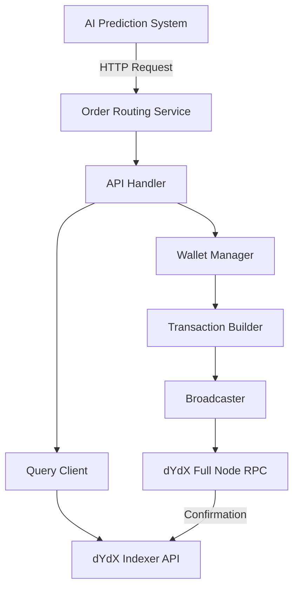
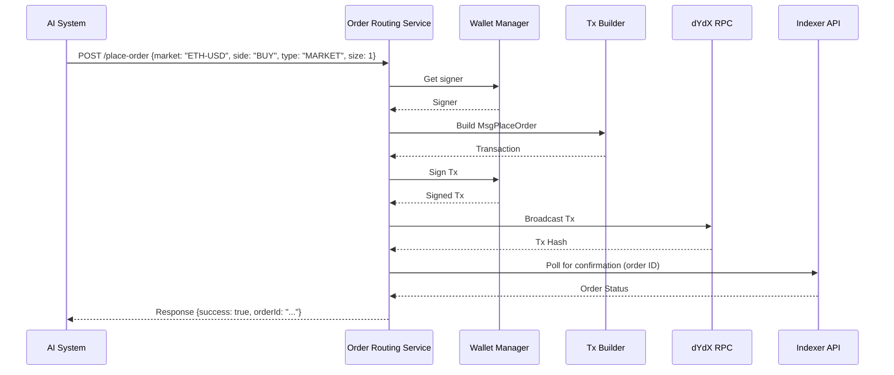

# RFC: Order Routing Service for dYdX V4 Exchange

**Authors:** Grok (Acting as Senior Software Engineer)  
**Status:** Draft  
**Date:** September 02, 2025  
**Version:** 1.0  

## Introduction

This RFC proposes the design and architecture for an MVP (Minimum Viable Product) order routing service in Golang. The service will integrate with the dYdX V4 decentralized exchange to route orders and manage positions securely and reliably. As part of a larger AI-driven trading system, this service acts as the execution layer, receiving order instructions from the prediction component and interacting directly with the dYdX chain.

The focus is on minimal functionality: placing and canceling orders, querying positions, and closing positions. Security emphasizes safe handling of wallet keys, while reliability includes error handling and retries. This design leverages the Cosmos SDK for transaction management, given dYdX V4's architecture as a Cosmos-based chain.

Key assumptions:
- The service will handle a single wallet/subaccount for MVP simplicity.
- AI prediction logic is out of scope; the service exposes an API for order requests.
- dYdX V4 uses on-chain order placement via signed transactions broadcast to validators.

## Background

dYdX V4 is a sovereign blockchain built on Cosmos SDK and CometBFT, supporting perpetual trading. Orders are placed by constructing and broadcasting transactions containing messages like `MsgPlaceOrder`. Queries for positions and orders use the Indexer API (RESTful) for efficient off-chain data access.

No official Golang client exists for dYdX V4 trading, so we'll implement using Cosmos SDK libraries and dYdX protocol modules. This ensures compatibility with the chain's RPC endpoints for broadcasting and the Indexer for queries.

## Requirements and Features

### Functional Requirements
- **Order Routing**:
  - Place short-term orders (e.g., market, limit) immediately via in-memory processing on validators.
  - Cancel orders by broadcasting `MsgCancelOrder`.
- **Position Management**:
  - Query open positions and balances via Indexer API.
  - Close positions by placing opposing orders (e.g., market close).
- **API Endpoints** (HTTP for MVP):
  - `/place-order`: Accepts order details (market, side, size, price, etc.) and routes to exchange.
  - `/cancel-order`: Cancels a specific order by ID.
  - `/get-positions`: Retrieves current positions.
  - `/close-position`: Closes a position for a given market.

### Non-Functional Requirements
- **Security**: Private keys stored securely (e.g., via environment variables or HashiCorp Vault for production). All transactions signed locally.
- **Reliability**: Implement retries for transaction broadcasts (up to 3 attempts). Monitor confirmation via Indexer.
- **Performance**: Target <1s latency for order placement in normal conditions.
- **Error Handling**: Graceful handling of failures (e.g., insufficient balance, network errors) with descriptive responses.
- **Logging and Monitoring**: Use structured logging (e.g., Zap) and expose metrics (e.g., Prometheus).

## Architecture

The service is a standalone Golang microservice with the following components:
- **API Layer**: Handles incoming requests using Gin or net/http.
- **Wallet Manager**: Manages mnemonic/private key, derives addresses, and signs transactions.
- **Transaction Builder**: Constructs Cosmos SDK transactions with dYdX-specific messages (e.g., `clob.MsgPlaceOrder`).
- **Broadcaster**: Broadcasts signed transactions to a dYdX full node RPC (gRPC or REST).
- **Query Client**: HTTP client for Indexer API to fetch positions, order status, etc.
- **Config**: Environment-based configuration for RPC URLs, Indexer URL, chain ID, etc.

The service will connect to:
- Full node RPC (e.g., https://rpc.dydx.trade) for broadcasting.
- Indexer API (e.g., https://indexer.dydx.trade/v4) for queries.

For MVP, no database is needed; state is queried on-demand from the chain.

### High-Level Diagram



### Sequence Diagram for Placing an Order



## Implementation Details

### Dependencies
- `github.com/cosmos/cosmos-sdk`: For client, tx building, and signing.
- `github.com/dydxprotocol/v4-chain/protocol`: For dYdX-specific types (e.g., `x/clob/types`).
- `github.com/cosmos/ledger-go`: Optional for hardware wallet support.
- `net/http` or `github.com/gin-gonic/gin`: For API server.
- `go.uber.org/zap`: For logging.
- Standard HTTP client for Indexer.

### Key Code Flows
1. **Wallet Setup**:
   - Load mnemonic from env var.
   - Derive HD wallet path for dYdX (e.g., m/44'/118'/0'/0/0).
   - Get address and subaccount.

2. **Placing an Order**:
   - Validate request.
   - Build `clob.MsgPlaceOrder` with params (client ID, order flags for short-term, quantums, subticks).
   - Note: Quantums and subticks are quantized values; service will handle conversion from user-friendly sizes/prices.
   - Create tx with gas fees estimated via simulation.
   - Sign with private key.
   - Broadcast synchronously.

3. **Querying Positions**:
   - GET to Indexer `/v4/subaccounts/{address}/0` for subaccount 0.
   - Parse positions from response.

4. **Closing a Position**:
   - Query current position size.
   - Place opposing market order to reduce to zero.

### Configuration Example
```yaml
chain_id: dydx-mainnet-1
rpc_url: https://rpc.dydx.trade:443
indexer_url: https://indexer.dydx.trade/v4
mnemonic: "<secret>"
gas_price: "0.025adv4tnt"
```

## Security Considerations

- **Key Management**: Never expose keys in logs or responses. Use secure storage; for MVP, env vars with restricted access.
- **Authentication**: API endpoints protected by API keys or JWT from the AI system.
- **Rate Limiting**: Implement to prevent abuse.
- **Validation**: Sanitize inputs to avoid injection; validate order params against market configs (fetched from Indexer).
- **Auditing**: Log all transactions for traceability.

Avoid holding keys in memory longer than necessary. In future iterations, support permissioned keys for delegated trading without full key exposure.

## Reliability Considerations

- **Retries**: Use exponential backoff for broadcast failures.
- **Confirmation**: Poll Indexer for tx inclusion (up to 30s timeout).
- **Failover**: Configurable multiple RPC endpoints.
- **Testing**: Unit tests for tx building; integration tests against testnet.
- **Monitoring**: Expose endpoints for health checks and metrics.

## Risks and Mitigations
- **Chain Congestion**: Mitigation: Adjustable gas prices.
- **Quantization Errors**: Mitigation: Fetch market atomic resolution from Indexer and convert accurately.
- **No Official Go Client**: Mitigation: Rely on protocol modules; test thoroughly against testnet.

## Next Steps
- Prototype implementation.
- Testnet validation.
- Security review.

---

This RFC provides a blueprint for the MVP. It balances minimalism with robustness, ensuring the service can reliably execute AI-driven trades on dYdX V4.

**Key Citations:**
- dYdX V4 Documentation: https://docs.dydx.exchange/ 
- dYdX Chain Repository: https://github.com/dydxprotocol/v4-chain 
- Order Types and Execution: https://docs.dydx.exchange/api_integration-trading/order_types 
- Indexer API: https://docs.dydx.exchange/api_integration-indexer/indexer_api 
- Onboarding and Order Placement FAQs: https://docs.dydx.exchange/introduction-onboarding_faqs