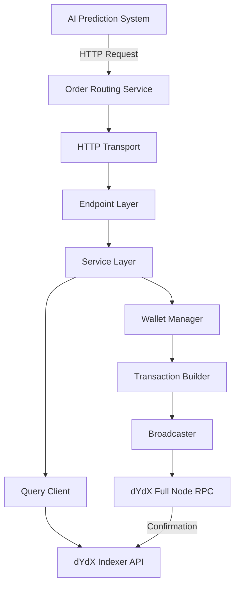
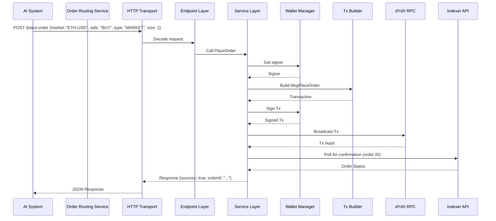

# RFC: Order Routing Service for dYdX V4 Exchange

**Authors:** Sander Ruscigno
**Status:** Implemented
**Date:** September 05, 2025  
**Version:** 1.1  

## Introduction

This RFC proposes the design and architecture for a Minimum Viable Product (MVP) order routing service written in Golang, using the **Go-Kit** framework, to integrate with the dYdX V4 decentralized exchange. The service serves as the execution layer for an AI-driven trading system, receiving order instructions from the prediction component and interacting with the dYdX chain to place and cancel orders and manage positions securely and reliably.

The MVP focuses on minimal functionality: placing and canceling orders, querying positions, and closing positions. Security emphasizes safe handling of wallet keys, while reliability includes robust error handling and retries. Go-Kit’s modular design ensures the MVP is simple yet scalable, allowing future expansion into a microservice architecture without significant rewrites. The service leverages the Cosmos SDK for transaction management and the dYdX Indexer API for queries, aligning with dYdX V4’s architecture as a Cosmos-based chain.

Key assumptions:
- The service handles a single wallet/subaccount for MVP simplicity.
- AI prediction logic is out of scope; the service exposes an HTTP API for order requests.
- dYdX V4 uses on-chain order placement via signed transactions broadcast to validators.

## Background

dYdX V4 is a sovereign blockchain built on Cosmos SDK and CometBFT, supporting perpetual trading. Orders are placed by constructing and broadcasting transactions containing messages like `MsgPlaceOrder`. Queries for positions and orders use the Indexer API (RESTful) for efficient off-chain data access.

No official Golang client exists for dYdX V4 trading, so we’ll implement using Cosmos SDK libraries and dYdX protocol modules. The choice of **Go-Kit** as the framework balances MVP simplicity with scalability, providing a modular structure that supports future expansion to gRPC or microservices.

## Requirements and Features

### Functional Requirements
- **Order Routing**:
  - Place short-term orders (e.g., market, limit) immediately via in-memory processing on validators.
  - Cancel orders by broadcasting `MsgCancelOrder`.
- **Position Management**:
  - Query open positions and balances via Indexer API.
  - Close positions by placing opposing orders (e.g., market close).
- **API Endpoints** (HTTP for MVP):
  - `/place-order`: Accepts order details (market, side, size, price, etc.) and routes to exchange.
  - `/cancel-order`: Cancels a specific order by ID.
  - `/get-positions`: Retrieves current positions.
  - `/close-position`: Closes a position for a given market.

### Non-Functional Requirements
- **Security**: Private keys stored securely via environment variables (MVP) or HashiCorp Vault (future). Transactions signed locally.
- **Reliability**: Implement retries for transaction broadcasts (up to 3 attempts). Monitor confirmation via Indexer.
- **Performance**: Target <1s latency for order placement under normal conditions.
- **Error Handling**: Graceful handling of failures (e.g., insufficient balance, network errors) with descriptive responses.
- **Logging and Monitoring**: Use structured logging with Zap and expose Prometheus metrics.
- **Scalability**: Go-Kit’s service and endpoint abstractions enable future expansion to gRPC or microservices without core rewrites.

## Architecture

The service is a standalone Golang microservice built with Go-Kit, structured into the following components:
- **Service Layer**: Contains business logic for order placement, cancellation, and position management.
- **Endpoint Layer**: Maps service methods to Go-Kit endpoints for API requests.
- **Transport Layer**: Handles HTTP requests/responses; supports future gRPC integration.
- **Wallet Manager**: Manages mnemonic/private key, derives addresses, and signs transactions.
- **Transaction Builder**: Constructs Cosmos SDK transactions with dYdX-specific messages (e.g., `clob.MsgPlaceOrder`).
- **Broadcaster**: Broadcasts signed transactions to a dYdX full node RPC (gRPC or REST).
- **Query Client**: HTTP client for Indexer API to fetch positions and order status.
- **Database Layer**: PostgreSQL for persistent order storage and status tracking.
- **Config**: Environment-based configuration for RPC URLs, Indexer URL, chain ID, database connection, etc.

The service connects to:
- Full node RPC (e.g., https://rpc.dydx.trade) for broadcasting.
- Indexer API (e.g., https://indexer.dydx.trade/v4) for queries.
- PostgreSQL database for order persistence and status tracking.

### Database Schema

The service uses PostgreSQL to store order information and track status changes:

```sql
-- Orders table for tracking all order operations
CREATE TABLE orders (
    id UUID PRIMARY KEY DEFAULT gen_random_uuid(),
    client_order_id VARCHAR(255) UNIQUE NOT NULL,
    dydx_order_id VARCHAR(255),
    market VARCHAR(50) NOT NULL,
    side VARCHAR(10) NOT NULL CHECK (side IN ('BUY', 'SELL')),
    order_type VARCHAR(20) NOT NULL CHECK (order_type IN ('MARKET', 'LIMIT', 'STOP_MARKET', 'STOP_LIMIT')),
    size DECIMAL(20,8) NOT NULL,
    price DECIMAL(20,8),
    status VARCHAR(20) NOT NULL DEFAULT 'PENDING' CHECK (status IN ('PENDING', 'OPEN', 'FILLED', 'PARTIALLY_FILLED', 'CANCELLED', 'REJECTED', 'EXPIRED')),
    tx_hash VARCHAR(64),
    created_at TIMESTAMP WITH TIME ZONE DEFAULT NOW(),
    updated_at TIMESTAMP WITH TIME ZONE DEFAULT NOW(),
    filled_size DECIMAL(20,8) DEFAULT 0,
    average_fill_price DECIMAL(20,8),
    error_message TEXT,
    INDEX idx_orders_status (status),
    INDEX idx_orders_market (market),
    INDEX idx_orders_created_at (created_at)
);

-- Order status history for audit trail
CREATE TABLE order_status_history (
    id UUID PRIMARY KEY DEFAULT gen_random_uuid(),
    order_id UUID NOT NULL REFERENCES orders(id),
    old_status VARCHAR(20),
    new_status VARCHAR(20) NOT NULL,
    changed_at TIMESTAMP WITH TIME ZONE DEFAULT NOW(),
    details JSONB,
    INDEX idx_order_status_history_order_id (order_id),
    INDEX idx_order_status_history_changed_at (changed_at)
);
```

### Project Structure
The Go-Kit project is organized as follows:
```
├── cmd/
│   └── main.go              # Application entry point
├── pkg/
│   ├── config/              # Configuration (RPC URLs, mnemonic, DB)
│   │   └── config.go
│   ├── database/            # Database connection and migrations
│   │   ├── migrations/      # SQL migration files
│   │   └── db.go
│   ├── repository/          # Data access layer
│   │   └── orders.go
│   ├── endpoint/            # Go-Kit endpoints
│   │   └── endpoint.go
│   ├── service/             # Business logic
│   │   └── service.go
│   ├── transport/
│   │   └── http/            # HTTP transport
│   │       └── http.go
│   ├── wallet/              # Wallet management
│   │   └── wallet.go
│   └── tx/                  # Transaction building/broadcasting
│       └── tx.go
├── docker-compose.yml       # Local development environment
├── Makefile                 # Development commands
├── .env.example             # Environment variables template
├── go.mod                   # Go module definition
└── go.sum
```

### High-Level Diagram



### Sequence Diagram for Placing an Order



## Implementation Details

### Framework Choice: Go-Kit
**Go-Kit** was selected for its balance of MVP simplicity and scalability:
- **Modularity**: Separates service logic, endpoints, and transport, allowing the MVP to focus on HTTP while supporting future gRPC or microservice expansion.
- **Middleware**: Supports authentication, logging, and metrics, meeting security and reliability requirements.
- **Flexibility**: Unneeded features (e.g., service discovery) can be ignored for the MVP.
- **Integration**: Compatible with Cosmos SDK for transaction building and HTTP/gRPC clients for dYdX APIs.

### Dependencies
- `github.com/go-kit/kit`: Core Go-Kit framework for service, endpoint, and transport layers.
- `github.com/go-kit/log`: Logging integration.
- `go.uber.org/zap`: Structured logging.
- `github.com/cosmos/cosmos-sdk`: Client, transaction building, and signing.
- `github.com/dydxprotocol/v4-chain/protocol`: dYdX-specific types (e.g., `x/clob/types`).
- `github.com/cosmos/ledger-go`: Optional for hardware wallet support.

### Key Code Flows
1. **Service Layer** (`pkg/service/service.go`):
   - Defines a `Service` interface with methods like `PlaceOrder`.
   - Handles business logic, validating inputs and coordinating with wallet and transaction components.
   - Example:
     ```go
     type Service interface {
         PlaceOrder(ctx context.Context, req OrderRequest) (OrderResponse, error)
     }
     ```

2. **Endpoint Layer** (`pkg/endpoint/endpoint.go`):
   - Maps service methods to Go-Kit endpoints.
   - Example:
     ```go
     func makePlaceOrderEndpoint(s Service) endpoint.Endpoint {
         return func(ctx context.Context, request interface{}) (interface{}, error) {
             req := request.(OrderRequest)
             return s.PlaceOrder(ctx, req)
         }
     }
     ```

3. **HTTP Transport** (`pkg/transport/http/http.go`):
   - Handles HTTP requests, decoding JSON into `OrderRequest` and encoding responses.
   - Example:
     ```go
     mux.Handle("/place-order", http.NewServer(
         endpoints.PlaceOrder,
         decodePlaceOrderRequest,
         encodeResponse,
     ))
     ```

4. **Wallet Setup** (`pkg/wallet/wallet.go`):
   - Loads mnemonic from configuration.
   - Derives HD wallet path (e.g., m/44'/118'/0'/0/0) using Cosmos SDK.
   - Provides signer for transactions.

5. **Transaction Building** (`pkg/tx/tx.go`):
   - Constructs `clob.MsgPlaceOrder` with quantized values (quantums, subticks).
   - Estimates gas fees via simulation.
   - Broadcasts signed transactions synchronously.

6. **Querying Positions**:
   - GET to Indexer `/v4/subaccounts/{address}/0` for subaccount 0.
   - Parses positions from response.

7. **Closing a Position**:
   - Queries position size via Indexer.
   - Places opposing market order to reduce to zero.

### Configuration Example
```go
type Config struct {
    RPCURL      string
    IndexerURL  string
    ChainID     string
    Mnemonic    string
    HTTPPort    string
}

func LoadConfig() Config {
    return Config{
        RPCURL:     getEnv("RPC_URL", "https://rpc.dydx.trade:443"),
        IndexerURL: getEnv("INDEXER_URL", "https://indexer.dydx.trade/v4"),
        ChainID:    getEnv("CHAIN_ID", "dydx-mainnet-1"),
        Mnemonic:   getEnv("MNEMONIC", ""),
        HTTPPort:   getEnv("HTTP_PORT", ":8080"),
    }
}
```

## Security Considerations

- **Key Management**: Mnemonic stored in environment variables for MVP; use HashiCorp Vault for production. Never log or expose keys.
- **Authentication**: Go-Kit middleware for API key or JWT authentication on endpoints.
- **Rate Limiting**: Implement middleware to prevent abuse.
- **Validation**: Sanitize inputs to avoid injection; validate order parameters against market configs from Indexer.
- **Auditing**: Log all transactions and API requests with Zap for traceability.

## Reliability Considerations

- **Retries**: Use exponential backoff for broadcast failures (up to 3 attempts).
- **Confirmation**: Poll Indexer for transaction inclusion (30s timeout).
- **Failover**: Support multiple RPC endpoints in configuration.
- **Testing**: Unit tests for service logic; integration tests against dYdX testnet.
- **Monitoring**: Expose Prometheus metrics for request latency and errors.

## Scalability Considerations
- **Go-Kit Advantage**: The service layer is transport-agnostic, allowing seamless addition of gRPC or new services without rewriting business logic.
- **Microservices**: Split into separate services (e.g., order routing, position management) by defining new Go-Kit services.
- **Telemetry**: Add OpenTelemetry middleware for distributed tracing in future iterations.

## Risks and Mitigations
- **Learning Curve**: Go-Kit’s abstractions require initial learning. Mitigate with documentation and examples (https://gokit.io/examples/).
- **Chain Congestion**: Adjustable gas prices to prioritize transactions.
- **Quantization Errors**: Fetch market atomic resolution from Indexer for accurate conversions.
- **No Official Go Client**: Test thoroughly against dYdX testnet using Cosmos SDK and protocol modules.

## Implementation Plan
1. **Boilerplate Setup** (Complete):
   - Initialize Go module and Go-Kit structure as described.
   - Implement `/place-order` endpoint with placeholder logic.
2. **Cosmos SDK Integration**:
   - Implement wallet key derivation and transaction building.
   - Test against dYdX testnet.
3. **Additional Endpoints**:
   - Add `/cancel-order`, `/get-positions`, and `/close-position`.
4. **Security and Monitoring**:
   - Add middleware for authentication and rate limiting.
   - Integrate Prometheus metrics.
5. **Testing and Deployment**:
   - Write unit and integration tests.
   - Deploy to a staging environment for testnet validation.

## Comparison of Frameworks
The decision to use Go-Kit was based on evaluating alternatives:
| **Framework** | **MVP Fit** | **Scalability** | **Ease of Ignoring Features** |
|---------------|-------------|-----------------|------------------------------|
| **Go-Kit** | Moderate: More setup than net/http but supports simple HTTP APIs. | High: Modular design enables gRPC or microservices. | High: Ignore service discovery, circuit breakers for MVP. |
| **Go-Zero** | Low: Complex setup with CLI-driven code. | High: Cloud-native features like discovery. | Low: Tightly coupled components. |
| **Kratos** | Low: Opinionated structure adds overhead. | High: gRPC and telemetry support. | Moderate: Mandatory proto-based setup. |
| **Gin** | High: Lightweight and fast for MVP. | Low: HTTP-focused, requires rewrite for microservices. | N/A: Not designed for complex features. |

Go-Kit was chosen to avoid future rewrites, as its structure supports scaling without modifying core logic, unlike Gin.

## Next Steps
- Implement wallet and transaction logic using Cosmos SDK.
- Add remaining endpoints and middleware.
- Conduct security review and testnet validation.
- Document API for AI system integration.

---

This updated RFC reflects the adoption of Go-Kit, detailing the project structure and implementation approach while preserving the original requirements. It ensures the MVP is functional and positions the system for future scalability.

**Key Citations:**
- dYdX V4 Documentation: https://docs.dydx.exchange/
- dYdX Chain Repository: https://github.com/dydxprotocol/v4-chain
- Go-Kit Documentation: https://gokit.io/
- Cosmos SDK Documentation: https://docs.cosmos.network/
- dYdX Indexer API: https://docs.dydx.exchange/api_integration-indexer/indexer_api
- Zap Logging: https://pkg.go.dev/go.uber.org/zap
- 
